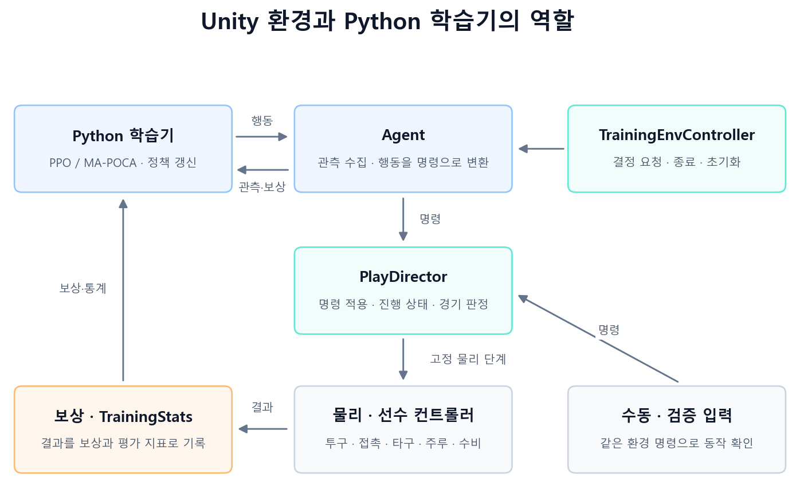
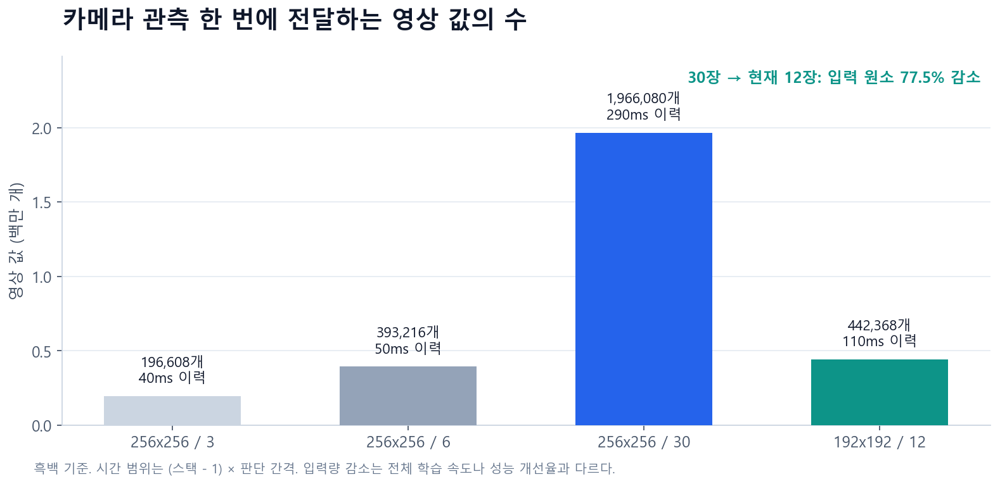
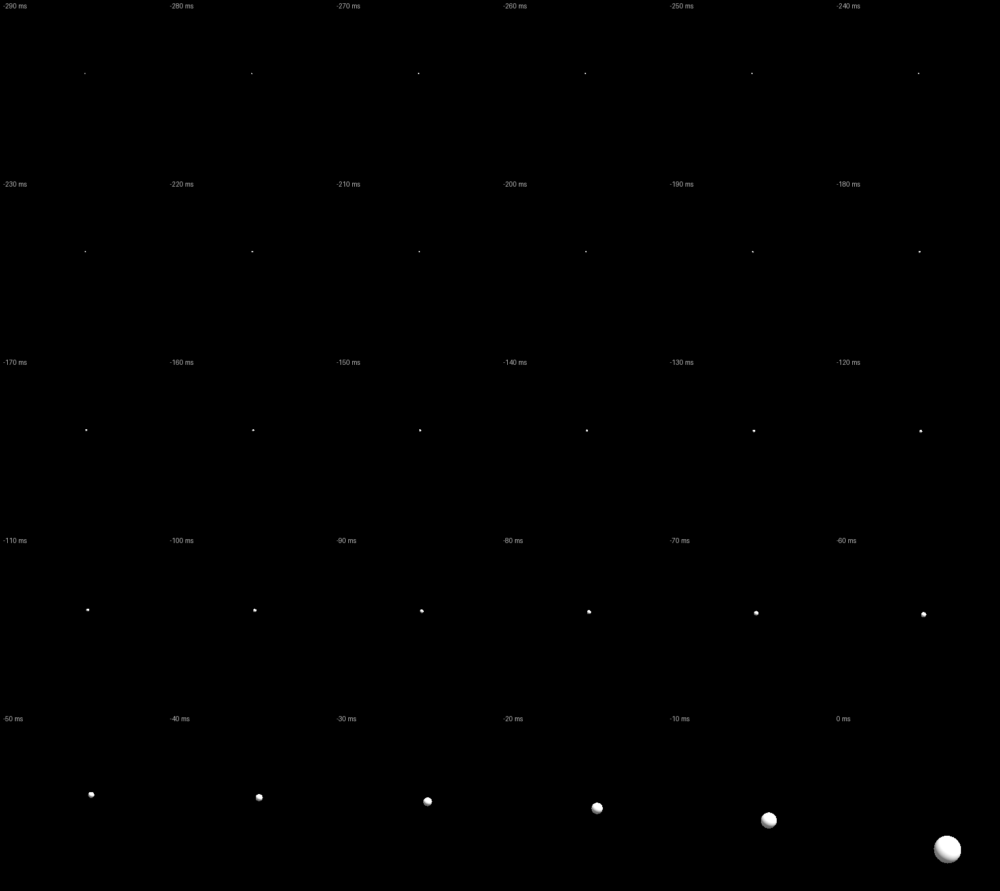
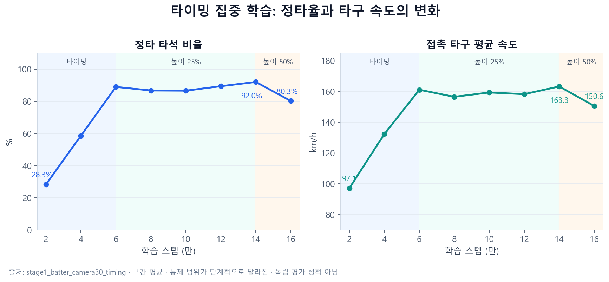
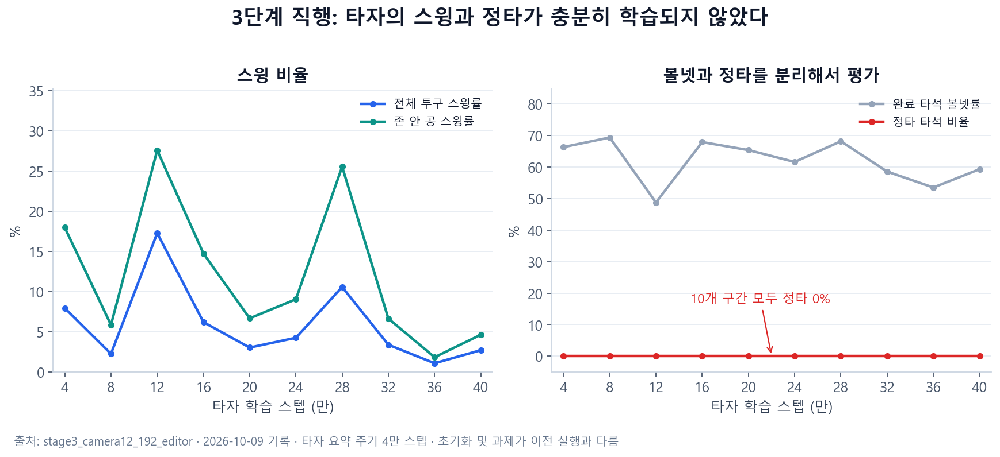

# 강화학습 프로젝트 — Unity ML-Agents 야구 시뮬레이션

> 투구·타격·주루·수비를 직접 구현하고, 관측과 보상, 학습 순서를 바꾸며 타격 정책을 개선한 개발 기록.
>
> 2026년 10월 9일 기준. Git 커밋 9개와 이후 작업본, 실제 TensorBoard 로그를 바탕으로 작성했다. 제한된 타격 훈련에서 얻은 성과와 전체 경기 환경에서 남아 있는 문제를 함께 정리했다.

야구에서 공을 한 번 치는 행동은 여러 판단이 연결된 결과다. 공이 어디로 오는지 파악하고, 배트가 지나갈 위치와 각도를 정한 뒤, 적절한 순간에 스윙해야 한다. 타구가 만들어진 이후에는 주자의 진루와 수비수의 포구·송구 판단까지 이어진다.

이 프로젝트에서는 이 과정을 Unity 시뮬레이션으로 만들고 ML-Agents에 연결했다. 정해진 시점에 스윙하는 스크립트만 만드는 대신, 에이전트가 관측을 받아 행동을 선택하고 실제 물리·경기 판정의 결과로 학습하도록 구성했다.

개발 과정에서 가장 크게 배운 점은 **학습이 실행되는 것, 보상이 증가하는 것, 실제로 야구를 잘하는 것이 서로 다른 검증 대상**이라는 사실이었다. 접촉률이 높아져도 약한 땅볼만 칠 수 있었고, 출루율이 높아져도 그 출루가 전부 볼넷일 수 있었다.

## 프로젝트 개요

| 항목 | 내용 |
| --- | --- |
| 개발 기록 범위 | 2026.09.11~2026.10.09 |
| 엔진 | Unity 6000.5.2f1, URP 17.5.0 |
| 개발 언어 | C#, Python |
| 학습 도구 | Unity ML-Agents 4.0.3, Python ML-Agents 1.1.0, PyTorch |
| 학습 알고리즘 | 타자·투수 PPO, 주자·수비 MA-POCA 기반 구성 |
| 분석 도구 | TensorBoard, 체크포인트·ONNX 검증, Unity Play Mode 검증 |
| 주요 구현 | 투구 물리, 실제 배트 접촉, 타구 판정, 볼카운트, 주루, 수비, 단계별 학습 |
| 현재 상태 | 세 단계 환경 구현 및 실행 검증 완료. 전체 경기에서의 안정적인 학습 성능은 개선 중 |

처음부터 정규 경기의 모든 규칙을 구현하기보다, 한 플레이가 시작되고 종료된 뒤 같은 조건으로 초기화될 수 있는 환경을 우선했다. 도루·실책·수비 방해 등은 현재 범위에 포함하지 않았다.

## 1. 학습 전에 야구 환경부터 만들기

첫 작업은 야구장 배치와 투구·타격의 기본 동작이었다. 기본 도형으로 경기장을 구성하고 공, 배트, 타자, 주자, 수비수의 상태를 코드로 관리했다. 수동 조작과 자동 입력이 같은 명령을 사용하도록 만들어, 학습기를 연결하기 전에도 개별 동작을 확인할 수 있게 했다.

이후에는 공이 배트에 닿았는지만 보는 단계를 넘어, 실제 타구가 어떻게 움직이고 어떤 경기 결과로 이어지는지를 구현했다.

| 구분 | 구현 내용 |
| --- | --- |
| 투구 | 포심·투심·커브·슬라이더·체인지업, 구속·회전·목표 위치 |
| 타격 | 타자 및 배트 배치, 스윙 시점·평면 각도, 실제 접촉과 타구 생성 |
| 타구 | 항력·회전에 따른 비행, 지면 반발·구름, 펜스 충돌 |
| 판정 | 볼·스트라이크·파울·인플레이·홈런·인정 2루타 |
| 타석 | 볼카운트, 삼진, 볼넷, 타석 단위 종료 |
| 주루·수비 | 포구, 송구, 포스·태그 아웃, 리터치, 진루·귀루, 득점 |
| 초기화 | 플레이 상태와 공·선수 상태 초기화, 시드 기반 재현 |

스트라이크 판정은 홈플레이트 앞쪽의 한 점만 검사하는 방식으로 끝나지 않았다. 플레이트 깊이를 포함한 입체 존을 검사해야 했고, 느린 변화구는 앞쪽에서 존 위를 지나도 뒤쪽에서 존에 닿을 수 있었다.

실제로 투수의 바깥쪽 목표 칸을 검사했을 때 일부 느린 변화구가 스트라이크로 들어왔다. 9월 30일 커밋에서는 이 문제를 반영해 맨 위 목표 행을 5cm 올렸다. 이 작업은 에이전트의 판단 이전에 **행동의 의미가 물리·판정 결과와 일치해야 한다**는 점을 확인한 사례였다.

## 2. 환경과 에이전트의 책임 분리

학습 기능을 추가하면서도 경기 규칙이 Agent 코드에 흩어지지 않도록 역할을 나눴다.



| 구성 요소 | 책임 |
| --- | --- |
| `PlayDirector` | 명령 수집, 물리 단계에서 명령 적용, 플레이 진행과 경기 판정 |
| `BallController`·`BatterController` 등 | 공·배트·선수의 실제 동작 |
| `TrainingEnvController` | 단계별 결정 요청, 타석 종료·초기화, 그룹 학습 연결 |
| 각 Agent | 관측 생성, 정책의 행동을 환경 명령으로 변환 |
| 보상 계산기 | 투구·타석·플레이 결과를 학습 보상으로 계산 |
| `TrainingStats` | 접촉률·정타율·선구·타구·수비 지표 기록 |
| Python 실행 도구 | 학습 시작·재개, 준비 과정 전환, 모델 저장·이식·검사 |

Agent는 Rigidbody나 경기 상태를 직접 바꾸는 대신 `PlayDirector`에 명령을 전달한다. 수동 조작, 검증용 스크립트, 학습 정책이 같은 경계를 사용하므로 특정 현상이 물리 문제인지 정책 문제인지 확인하기 쉬워진다.

결정 요청도 상황에 맞게 제한했다. 투수는 한 투구를 시작할 때 구종·구속·위치를 결정하고, 타자는 투구 중 스윙 여부를 판단한다. 주자와 수비수는 타구가 살아 있을 때 행동한다. 모든 에이전트가 매 순간 의미 없는 결정을 내리지 않도록 구성한 것이다.

한 씬 안에는 기본 4개의 경기장을 배치했다. 각 경기장은 별도 난수 시드와 참조를 사용하고, 좌표 관측은 자기 경기장 기준으로 계산한다. 화면에 보이는 경기장과 학습에 사용하는 다른 경기장들이 서로 영향을 주지 않는지도 검증했다.

## 3. 세 단계 학습 구성

처음부터 모든 역할을 동시에 학습시키면 타자가 타구를 만들지 못하는 동안 수비와 주루도 충분한 경험을 얻기 어렵다. 이를 줄이기 위해 학습 환경을 세 단계로 나눴다.

| 단계 | 학습 대상 | 주요 목표 |
| --- | --- | --- |
| 1단계 | 타자 | 스크립트 투수를 상대로 접촉·정타·선구 학습 |
| 2단계 | 타자·투수 | 5구종과 위치 선택을 포함한 대결 |
| 3단계 | 타자·투수·주자·수비 | 타구 이후 진루·포구·송구·아웃·득점 연결 |

2·3단계에는 타자와 투수의 셀프플레이 구성을 추가했다. 상대가 계속 바뀌는 학습 성적만으로 실력을 판단하지 않도록, 기준 스크립트 투수와 고정 타자 모델을 상대하는 평가도 별도로 기록했다.

수비 구성은 개발 도중 바뀌었다. 10월 2일 커밋에서는 9개 수비 역할로 확장했지만, 이후 작업본에서는 문제를 단순화했다. **현재 씬은 포수·1루수·2루수·3루수가 고정되고 중견수만 이동·송구를 학습하는 5명 수비 구성**이다. 투수는 투구를 담당한다. 따라서 현재 결과를 9명 수비의 협동 학습 완료로 표현할 수는 없다.

## 4. 에이전트의 관측과 행동

### 타자

타자는 자신의 상태와 경기 상황을 나타내는 16개 벡터 값, 그리고 공을 보는 카메라 영상을 받는다. 공의 실제 위치·속도를 정답 벡터로 직접 주지는 않는다.

| 관측 | 내용 |
| --- | --- |
| 진행 상태 | 자세 설정 가능 여부, 투구 비행 여부, 투구 경과 시간 |
| 타자 상태 | 몸의 기준 위치 대비 오프셋, 배트 손잡이 위치 |
| 타격 상태 | 스윙 시작 여부, 접촉 여부 |
| 경기 상황 | 볼·스트라이크·아웃, 각 베이스의 주자 유무 |
| 영상 | 현재 192×192 흑백, 12프레임 스택 |

행동 규격은 연속 7개와 스윙 여부를 나타내는 이산 행동으로 유지했다. 연속 행동은 몸 위치 2개, 배트 손잡이 위치 3개, 스윙 평면 각도 2개다. 현재는 몸 위치를 고정하기 때문에 앞의 2개 행동을 무시하고, 배트와 스윙 관련 행동을 사용한다.

이때 중요한 제약이 있다. **배트 손잡이 위치는 투구 전에 한 번만 설정된다.** 투구가 시작된 뒤 공을 보고 매 순간 손잡이 위치를 조절하는 구조는 아니다. 투구 중에는 스윙 여부를 판단하고, 스윙을 요청하는 순간 각도를 결정한다. 이 제약은 후반부의 센서·행동 설계 회고와 연결된다.

### 투수·주자·수비

| 역할 | 현재 관측 | 행동 |
| --- | --- | --- |
| 투수 | 타자 자세와 경기 상황 11개 값 | 구종 5개 중 선택, 구속, 5×5 목표 칸 |
| 주자 | 공·주자·베이스·경기 상황 65개 값 | 현재 판단 유지·진루·귀루 선택, 실제 달리기는 환경 처리 |
| 중견수 | 공·선수·역할·경기 상황 77개 값 | 평면 이동, 포구 후 1·2·3루 중 송구 목표 선택 |

투수의 목표 위치는 연속 좌표에서 이산 격자로 바꿨다. 초기 연속 좌표 학습에서는 출력이 경계로 포화되면서 볼만 던지는 정책이 만들어졌다. 5×5 격자는 스트라이크와 볼을 선택할 수 있는 의미 있는 후보를 제공하기 위한 변경이었다.

주자는 여러 슬롯이 같은 정책을 사용하고, 플레이 결과에 대한 그룹 보상을 받는다. 수비 역시 그룹 결과 보상과 개인의 포구·쫓기 신호를 함께 사용했다. 현재 중견수 단독 이동 구성에서는 고정 수비수의 베이스 커버를 학습 성과로 평가하지 않는다.

## 5. 카메라 입력을 바꿔 온 과정

초기 타자 모델은 레이 센서를 사용했다. 이후 공을 영상으로 관측하도록 포수 시점의 고정 카메라로 전환했다. 카메라는 타자 눈에 붙어 움직이는 시점이 아니라 홈 뒤에서 존을 바라보는 고정 시점이다.

영상 설정도 한 번에 정해지지 않았다.

| 시기 | 해상도·스택 | 촬영·판단 간격 | 최신부터 가장 오래된 영상까지 |
| --- | --- | --- | --- |
| 카메라 초기 | 256×256·3장 | 20ms | 40ms |
| 시간 해상도 확대 | 256×256·6장 | 10ms | 50ms |
| 긴 움직임 이력 | 256×256·30장 | 10ms | 290ms |
| 현재 | 192×192·12장 | 10ms | 110ms |



스택 수만 늘린다고 모델이 공의 궤적을 더 잘 이해한다고 보장할 수는 없다. 시간 정보를 더 주는 동시에 신경망 입력과 메모리 비용도 증가하기 때문이다. 256×256·30장은 한 번의 관측에 영상 값 1,966,080개를 전달한다. float32 배열만 약 7.5MiB이며, 학습 중 버퍼·중간 연산·그래디언트에는 추가 메모리가 필요하다.

현재 192×192·12장은 영상 값 442,368개, 약 1.69MiB다. 30장 구성보다 입력 원소 수가 77.5% 줄었다. 이 수치는 **영상 입력량의 감소**이며 전체 학습 속도가 같은 비율로 빨라졌다는 뜻은 아니다.

배경의 영향을 줄이기 위해 센서 카메라는 검은 배경에 공만 렌더하도록 변경했다. 일반 게임 화면은 유지하면서 학습 영상만 단순화했다.



*이전 30장 구성에서 저장한 실제 센서 입력. 각 칸은 10ms 간격이며, 공이 가까워질수록 영상에서 커진다. 일반 게임 화면이나 현재 12장 입력의 예시는 아니다.*

해상도와 스택이 바뀌면 신경망 입력 차원도 달라진다. 기존 모델을 그대로 불러올 수 없어 별도 초기화 모델을 만들었다. 특히 30장에서 12장으로 줄이는 과정은 과거 채널의 가중치를 합치고 공간 가중치를 보간하는 근사 이식이었다. 원본 체크포인트는 보존했지만, 동일한 행동이나 타격 성능까지 보존된다고 가정하지 않았다.

## 6. 보상은 ‘맞혔다’보다 ‘어떻게 맞혔는가’

카메라 학습 초반에는 스윙을 거의 하지 않는 정책이 나타났다. 접촉을 경험하게 만드는 것이 먼저라고 보고, 중앙 투구와 제한된 자세에서 접촉 보상을 주는 준비 과정을 도입했다.

이후 접촉률은 올라갔지만 새로운 문제가 생겼다. `stage1_batter_camera_contact`의 마지막 집계에서는 스윙 중 접촉률이 79.15%였지만, 평균 타구 속도는 60.80km/h, 발사각은 −21.94°, 첫 낙하거리는 약 1.29m였다. 공을 건드리는 행동은 배웠으나 강한 타구로 이어지지 않았다.

그래서 접촉 보상을 준비 초기에 한정하고, 이후에는 실제 페어 타구의 품질을 평가하도록 수정했다.

프로젝트에서 정한 정타 조건은 다음과 같다. 공식 야구 통계의 정타 정의가 아니라 학습 목표를 구체화한 프로젝트 내부 기준이다.

- 실제 페어 접촉
- 접촉 품질 `Q ≥ 0.6`
- 초기 타구 속도 `v ≥ 120km/h`
- 발사각 `5° ≤ a ≤ 35°`

접촉 품질에는 타이밍과 스위트스폿 정확도가 반영된다. 정타를 만족한 타구에는 약 2.63~3.0의 투구 타격 보상을 주고, 정타에 미달하더라도 좋은 방향으로 접근한 페어 타구에는 진행 보상을 주었다.

```text
정타 미달 페어 보상
= (0.25 + 1.25 × (0.75 × clip(Q / 0.6) + 0.25 × clip(v / 120))) × L(a)

L(a) = clip(a / 5) × clip((50 - a) / 15)
clip(x) = 0~1 범위로 제한
```

품질에 75%, 속도에 25%의 비중을 두고 진행 보상 상한을 0.5에서 1.5로 높였다. 내려치는 타구나 지나치게 높은 타구에는 각도 항이 작아지도록 했다. 이 보상은 준비 과정과 준비 보상 모드에 적용하며, 파울·헛스윙에는 지급하지 않는다.

| 상황 | 보상 설계 |
| --- | --- |
| 준비 초기 실제 접촉 | 접촉 추가 보상으로 첫 성공 경험 유도 |
| 정타 미달 페어 | 품질·속도·발사각에 따른 진행 보상, 최대 1.5 |
| 정타 | 약 2.63~3.0의 투구 타격 보상 |
| 볼넷·삼진 | 타석 결과에서 각각 +1 / −1 |
| 해결된 인플레이 | 타자 획득 베이스·득점·아웃을 결과 보상에 반영 |
| 미해결 시간 초과 | 정상 세이프·득점으로 확정하지 않고 에피소드 중단 |

수비에서도 보조 보상과 실제 성과를 구분했다. 공에 가까워지는 포텐셜 차분을 학습 신호로 사용할 수 있지만, 그 보상의 단순 합이 높다는 이유로 포구를 잘한다고 판단하지 않았다. 포구율·아웃·실점·시간 초과를 따로 확인해야 했다.

## 7. 효과가 확인된 변경: 타이밍 집중 학습

타자에게 모든 행동을 한꺼번에 맡기면 잘못된 타구가 타이밍 때문인지, 배트 높이 때문인지, 스윙 각도 때문인지 구분하기 어렵다. 따라서 몸을 고정하고, 배트 위치와 각도를 제한한 상태에서 스윙 시점을 먼저 학습하도록 바꿨다.

준비 과정은 타이밍에서 시작해 높이 25·50·100%, 각도 25·50·100%, 배트 X/Z 위치 25·50·100% 순으로 제어 범위를 넓히도록 구성했다. 각 과정은 최소 학습량과 실제 페어·정타 성적을 함께 확인해 전환하도록 했다.



| 집계 스텝 | 주로 적용된 과정 | 정타 타석 비율 | 접촉 타구 평균 속도 |
| --- | --- | ---:| ---:|
| 20,000 | 타이밍 | 28.27% | 97.14km/h |
| 60,000 | 타이밍 | 88.98% | 161.16km/h |
| 140,000 | 높이 25% | 92.03% | 163.31km/h |
| 160,000 | 높이 50% | 80.25% | 150.63km/h |

이 실행은 162,901스텝에 정상 저장했다. 제한된 투구와 행동 범위에서는 정타를 만드는 정책이 실제로 학습되었다. 다만 높이 50% 과정에 머문 상태였고, 전체 준비 과정이 완료된 것은 아니었다.

또한 타이밍 과정 분리와 진행 보상 강화가 함께 적용된 실행이므로, 개선 폭을 어느 한 변경의 효과로만 설명할 수 없다. 위 성적은 학습 중 기록된 구간 통계이며, 새로운 구종·위치에 대한 독립적인 일반화 평가 결과도 아니다.

## 8. 실행 성능 개선: 반복 영상 변환 줄이기

30장 입력에서는 학습 속도와 에디터 화면 지연도 문제가 되었다. 계산량을 줄이기 전에 기존 영상 처리 경로를 확인했고, 인접한 관측에 대부분 같은 과거 프레임이 반복되어 들어간다는 점에 주목했다.

기존 경로는 같은 PNG 프레임을 반복해서 디코딩하고 흑백 배열로 변환했다. 여기에 프레임 캐시를 두어 이미 처리한 프레임은 재사용하고, 새 프레임만 변환하도록 했다.

구현에서는 프레임 순서, 초기화 직후 관측, 여러 에이전트 간 데이터 혼합을 주의했다. 캐시는 최대 64MiB로 제한하고, 반환하는 스택 배열은 별도 메모리를 사용하도록 했다. 기존 함수와 픽셀 배열이 정확히 같은지도 비교했다.

| 별도 영상 변환 시험 | 결과 |
| --- | ---:|
| 기존 변환 | 약 1.367초 |
| 캐시 적용 변환 | 약 0.080초 |
| 변환 구간 속도 비율 | 약 17.12배 |
| 배열 일치 비교 | 190회 통과 |

이는 합성 슬라이딩 PNG 입력을 변환하는 구간만 측정한 결과다. Unity 물리·렌더링·통신·PPO 갱신을 포함한 전체 학습이 17배 빨라졌다는 결과로 사용하지 않았다.

현재는 프레임 캐시와 192×192·12장 입력을 함께 사용한다. 영상 입력량을 줄이고 중복 처리를 피하는 작업은 완료했지만, 최종 타격 성능과 에디터 체감 프레임률은 별도로 평가해야 한다.

## 9. 3단계 직행 이후의 결과

실행 시간을 줄이기 위해 준비 과정과 2단계를 생략하고 3단계로 직접 진입하는 경로도 구성했다. 이 경로는 기존 타자 가중치를 초기값으로 사용하지만, 준비 성적을 통과한 것으로 처리하지 않는다.

이후 카메라를 192×192·12장으로 바꾸고 에디터에서 학습한 `stage3_camera12_192_editor`를 확인했다. 10월 9일 22시 52분에 수집한 기록에서 타자의 마지막 정책 학습 요약은 400,000스텝이었다. 투수는 4,000, 주자는 80,000, 수비는 38,000스텝까지 요약이 기록되어 있었다. 역할마다 결정 빈도와 학습 방식이 달라 이 숫자를 같은 단위의 경험량으로 비교하지는 않는다.



타자의 400,000스텝 구간 성적은 다음과 같다.

| 지표 | 값 | 해석 |
| --- | ---:| --- |
| 전체 투구 스윙률 | 2.71% | 대부분의 공에 스윙하지 않음 |
| 존 안 공 스윙률 | 4.63% | 스트라이크에도 적극적으로 대응하지 못함 |
| 스윙 중 접촉률 | 12.50% | 드물게 나온 스윙을 분모로 한 조건부 비율 |
| 투구 중 인플레이 | 0.17% | 실제 타구 기회가 매우 적음 |
| 정타 타석 비율 | 0% | 첫 4만부터 40만까지 10개 요약 구간 모두 0% |
| 완료 타석 출루율 | 59.32% | 같은 구간 볼넷률과 동일 |
| 평균 에피소드 보상 | −1.784 | 성공적인 타격 정책으로 보기 어려움 |

타자와 투수는 셀프플레이에서 학습 팀을 교대한다. 타자 요약이 40만에서 멈추고 이후 투수 요약이 생겼다는 이유만으로 학습기가 멈췄다고 해석하지 않았다. 가장 최근 수비 쪽 집계에 기록된 공통 경기 통계에서도 정타가 거의 없는 상태는 이어졌다.

이 결과는 제한된 타이밍 환경의 성공을 전체 경기 성능으로 바로 확대해서 해석하면 안 된다는 점을 보여준다. 카메라 입력과 모델을 바꾸는 동시에 구종·위치·제어 범위·상대 조건까지 달라졌기 때문에, 성적 저하를 센서 하나의 문제로 단정할 수도 없다.

## 10. 센서보다 먼저 확인해야 했던 행동 제약

현재 타자는 투구 전에 배트 손잡이 위치를 설정하고, 투수는 그 자세를 관측한 뒤 투구를 선택한다. 공이 날아오는 동안 타자는 영상을 계속 받지만 손잡이 위치를 다시 바꾸지는 못한다.

따라서 높은 공과 낮은 공을 보고 배트 위치를 반응적으로 맞추는 능력을 기대한다면, 관측을 개선하는 것과 별개로 행동 적용 시점을 검토해야 한다. 각도와 타이밍으로 대응할 수 있는 범위는 있지만, 손잡이 위치까지 자유롭게 수정하는 타자와는 다른 문제를 풀고 있다.

이 제약이 현재 정타율 저하를 얼마나 설명하는지는 추가 실험이 필요하다. 다만 코드에서 직접 확인되는 설계 조건이므로, 다음 학습을 시작하기 전에 먼저 명확히 해야 할 항목으로 남겼다.

카메라도 같은 관점에서 다시 평가하게 되었다. 현재 모델은 영상에서 공을 찾고 움직임을 추정하는 일과, 배트를 제어하는 일을 동시에 학습한다. 타격 제어가 제대로 가능한지 먼저 확인하려면 상대 위치·속도 같은 수치 관측을 쓰는 기준 모델이 유용할 수 있다.

다만 물리 엔진의 실제 공 좌표를 주는 것은 기존의 ‘공 정답 정보를 직접 주지 않는다’는 조건을 바꾸는 선택이다. 그 조건을 유지한다면 영상에서 추출한 공의 중심·크기·이동량을 입력하는 방식을 검토할 수 있다. 레이 센서도 3차원 방향으로 배치할 수 있지만, 작은 공이 레이 사이를 지나가는 문제와 감지 해상도를 따로 확인해야 한다. 이 대안들은 아직 구현·비교 실험을 마친 결과가 아니다.

## 11. 무엇을 검증했고, 무엇이 남았는가

검증은 환경 동작, 학습 연결, 정책 성능으로 나누어 진행했다.

| 구분 | 확인한 내용 | 결과의 범위 |
| --- | --- | --- |
| 환경 | 실제 접촉, 볼카운트, 구종, 주루·수비, 연속 초기화 | 단계별 Unity 검사 및 실행 파일 빌드 통과 |
| 센서 | 실제 입력 크기, 프레임 순서, 공 전용 영상 | 카메라 계약과 실제 관측 검사 통과 |
| 모델 이식 | actor·critic 로드, 유한 출력, 원본 보존, ONNX 검사 | 입력 변경 후 학습을 시작할 수 있는 상태 확인 |
| 영상 캐시 | 기존 변환과 배열 일치, 초기화·순서·메모리 제한 | 픽셀 값 보존 확인 |
| 짧은 학습 | 실제 정책 갱신 및 체크포인트 저장 | 12장 구성에서 첫 CNN을 포함한 정책 텐서 갱신 확인 |
| 제한된 타격 | 타이밍·일부 높이 제어 | 마지막 정타율 80.25%, 속도 150.63km/h |
| 전체 경기 | 다양한 투구, 전체 제어, 대결·주루·수비 | 안정적인 타격 성능 미달, 추가 개선 필요 |

검증 스크립트가 타격 시점을 골라 넣어 만든 정타는 물리적으로 정타가 가능한지를 확인하는 자료로 사용했다. 학습 모델의 성공률로 섞지 않았다. 마찬가지로 짧은 학습에서 가중치가 갱신되고 모델 파일이 저장되었다는 사실은 장기 성능 향상을 보장하지 않는다.

## 12. 커밋과 작업본에서 확인한 개발 흐름

| 날짜 | 커밋 | 실제 변경의 중심 |
| --- | --- | --- |
| 09.11 | `153eeda` | 저장소 초기화 |
| 09.11 | `bde8143` | Unity 프로젝트 초기 구성과 환경·구조·검증 문서 |
| 09.18 | `bfb464a` | 투구·타격, 수동 명령, 타격 평가, 기본 시뮬레이션 구조 |
| 09.18 | `a697ae5` | 타자 파워 관련 수정과 검증 문서 |
| 09.27 | `2affef8` | ML-Agents 연결, 구종·판정·주루·수비, 단계별 학습 구성 |
| 09.30 | `5f846cf` | 2단계 학습 기록, 투수 격자 윗줄 보정, 재개 설정 |
| 10.01 | `c290916` | 3단계 보상·학습 흐름 수정, 수비 포텐셜 보조 보상 |
| 10.01 | `dd7b6cf` | 수비 역할별 보상과 내야 커버 관련 보완 |
| 10.02 | `9240392` | 수비 역할 9개 확장, 관련 관측·설정·검증 및 학습 기록 |
| 마지막 커밋 이후 | 작업본 | 수비 단순화, 카메라 전환, 시간 간격·스택 변경, 타이밍 준비 과정, 정타 보상, 캐시, 모델 이식 |

커밋 메시지만으로 완료 상태를 판단하지 않았다. 마지막 커밋 제목은 `feat: 끝`이지만 이후에도 환경과 학습 설정이 크게 바뀌었고, 현재 로그에는 해결해야 할 타격 성능 문제가 남아 있다. 위 표의 날짜는 커밋 날짜이며, 모든 기능이 그 하루에 작성되었다는 의미는 아니다.

## 회고

가장 의미 있었던 성과는 실제 물리·경기 판정이 있는 환경과 학습 정책을 연결하고, 실패한 정책을 수치로 설명할 수 있게 된 것이다. 접촉률만 보면 놓치던 약한 내려치기, 출루율만 보면 놓치던 볼넷 의존, 보조 보상만 보면 놓치던 수비 성능 문제를 각각 다른 지표로 확인했다.

제한된 타이밍 학습에서는 정타율과 타구 속도가 함께 개선되었다. 이를 통해 정타가 가능한 환경이고, 적절히 제한된 과제에서는 정책이 그 행동을 학습할 수 있다는 근거를 얻었다. 동시에 그 모델을 전체 경기로 옮기는 과정은 별도의 문제라는 것도 확인했다.

다음 실험에서는 센서·행동·커리큘럼을 한 번에 바꾸기보다 같은 평가 조건을 유지하며 하나씩 비교하려 한다. 먼저 투구 중 배트 위치를 조절할 수 있는 범위를 명확히 하고, 현재 12장 모델을 제한된 타이밍 과제에서 다시 평가하는 것이 우선이다. 이후 수치 관측 또는 영상 추적 관측과 비교하면 공 인식의 어려움과 타격 제어의 어려움을 더 분명하게 구분할 수 있다.

현재 프로젝트의 결과는 완성된 야구 AI보다, **야구 AI의 관측·행동·보상·학습 과정을 실제 로그로 검증할 수 있는 시뮬레이션과 실험 기반을 구축한 것**에 가깝다. 다음 개선도 이 기반 위에서 측정 가능한 변화로 남기려 한다.

---

### 근거 자료

- 구조·범위: [환경 명세](environment-spec.md), [아키텍처](architecture.md), [학습 커리큘럼](training-curriculum.md)
- 관측·행동: [타자](batter-agent.md), [투수](pitcher-agent.md), [수비·주루](fielding-agents.md)
- 변경 계약: [타이밍·정타 보상](batter-timing-progress.md), [영상 캐시](batter-visual-cache-stage3.md), [192×192·12장](batter-camera12-192.md)
- 실제 검사 기록: [검증 문서](verification.md)
- 학습 수치: `Training/evaluations/log-analysis-20261009.json`, `Training/evaluations/history-review-20261009.json` 및 각 실행의 TensorBoard 이벤트
- 그래프 원자료: [plot-data.json](assets/baseball-rl-retrospective/plot-data.json)

접촉률은 스윙을 분모로, 정타율은 완료 타석을 분모로 계산한다. 서로 다른 실행의 스텝은 각 실행 안의 계수이며, 모델 이식·재개 이력을 무시하고 합산하지 않았다. 그래프는 저장된 요약 값을 사용했고 임의 평활화하지 않았다. 관측·보상·투구 조건이 다른 실행 간 수치는 통제된 성능 비교 실험으로 해석하지 않는다.
